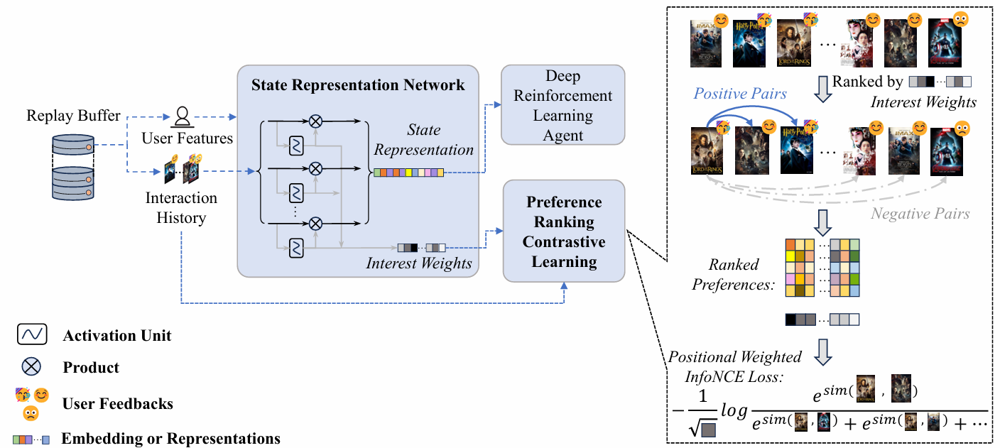
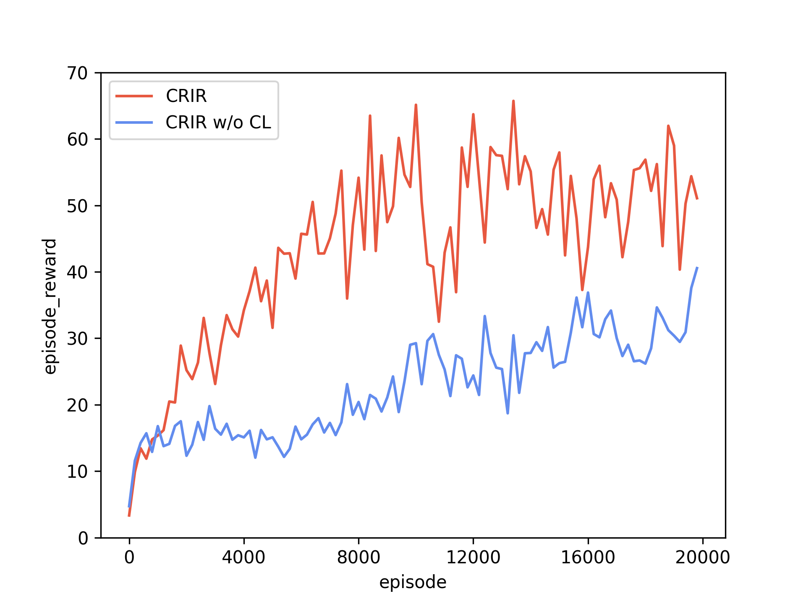

# Contrastive Representation for Interactive Recommendation (CRIR)

Paper : [Contrastive Representation for Interactive Recommendation](https://arxiv.org/abs/2412.18396), accepted by AAAI-2025.

**Authors: [Jingyu Li](https://httpwww404notfound.github.io/JingyuLi/)** , Zhiyong Feng*, Dongxiao He, Hongqi Chen, Qinghang Gao, Guoli Wu



### Abstract

Interactive Recommendation (IR) has gained significant attention recently for its capability to quickly capture dynamic interest and optimize both short and long term objectives. IR agents are typically implemented through Deep Reinforcement Learning (DRL), because DRL is inherently compatible with the dynamic nature of IR. However, DRL is currently not perfect for IR. Due to the large action space and sample inefficiency problem, training DRL recommender agents is challenging. The key point is that useful features cannot be extracted as high-quality representations for the recommender agent to optimize its policy. To tackle this problem, we propose Contrastive Representation for Interactive Recommendation (CRIR). CRIR efficiently extracts latent, high-level preference ranking features from explicit interaction, and leverages the features to enhance users' representation. Specifically, the CRIR provides representation through one representation network, and refines it through our proposed Preference Ranking Contrastive Learning (PRCL). The key insight of PRCL is that it can perform contrastive learning without relying on computations involving high-level representations or large potential action sets. Furthermore, we also propose a data exploiting mechanism and an agent training mechanism to better adapt CRIR to the DRL backbone. Extensive experiments have been carried out to show our method's superior improvement on the sample efficiency while training an DRL-based IR agent.

### Simulation Environment

We provide the usage of [Virtual-Taobao](https://github.com/eyounx/VirtualTaobao) [1]. If you want to use datasets to run CRIR, a simulation environment constructed by the dataset is required to conduct CRIR.

> Jing-Cheng Shi, Yang Yu, Qing Da, Shi-Yong Chen, and An-Xiang Zeng. [Virtual-Taobao: Virtualizing real-world online retail environment for reinforcement learning](https://arxiv.org/abs/1805.10000). In: Proceedings of the 33rd AAAI Conference on Artificial Intelligence (AAAI’19), Honolulu, HI, 2019.

### Run the code

You may need these packages to run the code.

```yaml
- Pytorch
- Gym
- Virtual-Taobao
-- see https://github.com/eyounx/VirtualTaobao
- Matplotlib
```

We provide a click-to-run code framework to show CRIR model. You can run 'main.py' directly to see how the programme is running if you have successfully installed the packages. You can add running parameters following the parameters which exist in the 'main.py'.

We also provide a visualization programme for experimental results. You can run 'plot.py' after having got results for experiments. You may pay attention to the variables which refer to data directory or evaluation metrics.

Here is one example for visualization of the experimental results.



### Citation

Please cite our work if you find it useful.

> Li, J., Feng, Z., He, D., Chen, H., Gao, Q., & Wu, G. (2025). Contrastive Representation for Interactive Recommendation. Proceedings of the AAAI Conference on Artificial Intelligence, 39(11), 12058-12066. 

or in bibtex form:
```bibtex
@article{Li_Feng_He_Chen_Gao_Wu_2025, title={Contrastive Representation for Interactive Recommendation}, volume={39}, url={https://ojs.aaai.org/index.php/AAAI/article/view/33313}, DOI={10.1609/aaai.v39i11.33313}, abstractNote={Interactive Recommendation (IR) has gained significant attention recently for its capability to quickly capture dynamic interest and optimize both short and long term objectives. IR agents are typically implemented through Deep Reinforcement Learning (DRL), because DRL is inherently compatible with the dynamic nature of IR. However, DRL is currently not perfect for IR. Due to the large action space and sample inefficiency problem, training DRL recommender agents is challenging. The key point is that useful features cannot be extracted as high-quality representations for the recommender agent to optimize its policy. To tackle this problem, we propose Contrastive Representation for Interactive Recommendation (CRIR). CRIR efficiently extracts latent, high-level preference ranking features from explicit interaction, and leverages the features to enhance users’ representation. Specifically, the CRIR provides representation through one representation network, and refines it through our proposed Preference Ranking Contrastive Learning (PRCL). The key insight of PRCL is that it can perform contrastive learning without relying on computations involving high-level representations or large potential action sets. Furthermore, we also propose a data exploiting mechanism and an agent training mechanism to better adapt CRIR to the DRL backbone. Extensive experiments have been carried out to show our method’s superior improvement on the sample efficiency while training an DRL-based IR agent.}, number={11}, journal={Proceedings of the AAAI Conference on Artificial Intelligence}, author={Li, Jingyu and Feng, Zhiyong and He, Dongxiao and Chen, Hongqi and Gao, Qinghang and Wu, Guoli}, year={2025}, month={Apr.}, pages={12058-12066} }
```
